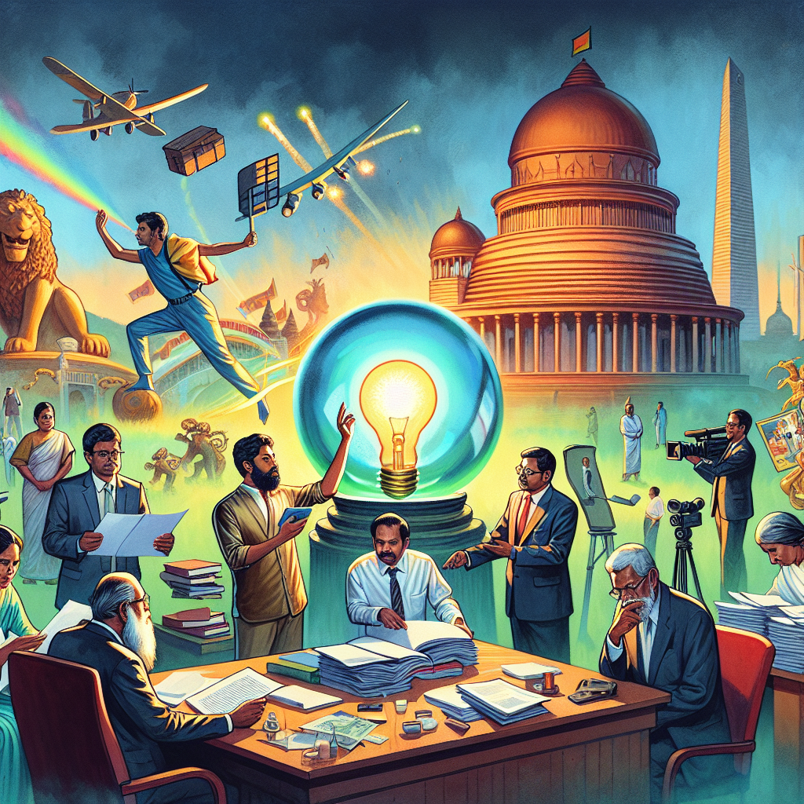

# How filmmakers and lawmakers view people’s trust - EDITORIAL

## AI Generated Summary

- Sri Lankans are cautious about trusting politicians due to past bad experiences.
- Many citizens in Sri Lanka haven't received a university education, leading to a reliance on instinct for trust.
- Gotabaya Rajapaksa was elected based on people's instincts, which proved to be misplaced.
- The government often rushes to implement programs, like the new and criticized visa system.
- Despite issues, tourism remains profitable in Sri Lanka; the government should maintain travel-friendly policies.
- Tourists often rely on instincts due to potential dishonesty from local shop owners.
- Aristocratic leaders historically overlooked smaller administrative details.
- Former President Ranasinghe Premadasa valued the working class and small matters, contrasting with many politicians.
- Premadasa had integrity and earned public trust, considered a greater compliment than being loved.
- Films about politicians, like 'Ginnen Upan Seethala,' highlight public perceptions and trust issues.
- Trust is essential in both politics and filmmaking; one should be cautious in giving it, as appearances can be deceptive (like sugar and salt).

## Original Text

[https://www.dailymirror.lk/opinion/How-filmmakers-and-lawmakers-view-peoples-trust-EDITORIAL/172-282288](https://www.dailymirror.lk/opinion/How-filmmakers-and-lawmakers-view-peoples-trust-EDITORIAL/172-282288)

*2024-05-10T01:00:00+05:30*

Sri Lankans may be wary of trusting their instincts given their bad experiences with politicians. This is a country where the majority of the citizenry hasn’t had the fortune of receiving a university education. Hence, for some of them, trust must be built on instinct. 

This instinct is the tool people relied on when electing Gotabaya Rajapaksa as president. He was the last Executive of this country who was elected through the vote of the people. The instinct in people that this president would deliver proved the former horribly wrong. 

This is a country where its regime initiates programmes in a hurry and then repents. The latest is the new visa system where users are subject to paying higher fees. The new visa portal- which operates online- replaces the old system where visas were issued more efficiently through an Electronic Travel Authorization system. Now there is all-round criticism aimed at the new visa system. 

Still, with all these red tape issues, tourism in Sri Lanka remains a lucrative business. The government must stick to its travel-friendly policies which are aimed at inviting visitors to this island in their numbers. This is a nation- that not very long ago- boasted of offering visa-free entry to a few selected countries. Tourists visiting this sun-kissed nation are well aware of the prices of goods and services offered by locals, individuals and eateries which must be avoided. Now these tourists are forced to trust their instincts more than the information they gather through their search on the Internet. This is because so many foreign tourists have been ripped off by dishonest shop owners. 

We have had aristocratic leaders in this country. Most of them viewed the larger picture when it came to administrating the country. Leaders like former President Ranasinghe Premadasa changed that style of governance. President Premadasa did this by carrying out programmes where he gave prominence to the worker in the ‘wheel of production’. The difference between leaders such as President Premadasa and some of the aristocratic leaders of this island was that the former gave value and showed interest in matters which were considered small. There is an old saying which states ‘he who can take no interest in what is small will take false interest in what is great’. This is so true with our present-day politicians too. Hence there was a time when the working class of this country built trust around a leader who understood the pulse of the people. 

President Premadasa always put money in places of trust; never the other way around. The former President had a frank opinion about all things that mattered to the nation. In this equation, people with integrity stood tall. There may be a section of the society who may beg to differ with the opinions expressed about this president in this column. They must be reminded of a quotable quote from Scottish author and poet George McDonald which states, ‘To be trusted is a greater compliment than to be loved’. There were so many leaders who came after Premadasa and were loved by the people, but this writer doesn’t wish to waste precious newspaper space writing about them and their disastrous pasts. 

Many films have been made revolving around the careers of politicians and their characters. One such recent film made and much talked about in the political scene was ‘Ginnen Upan Seethala’ which translated into English will read ‘Cold born from fire’. That film is about former JVP Leader Rohana Wijeweera and his character is played by the versatile artiste Kamal Addararachchi. There is a similarity between a politician and a filmmaker. Both these individuals believe that there is an audience for them. In other words, they trust their audience. There are films in the world which have nudged regimes and sent strong messages to leaders. On the other hand a good many of them have been failures too and people have been let down. One must be careful in whom you trust. Sugar and salt look the same!  

