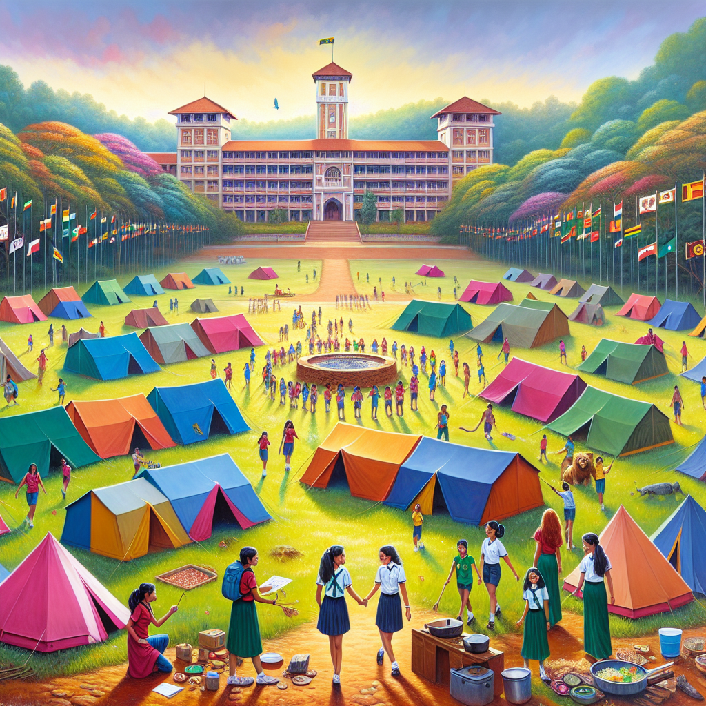

# “CEYLONA 2024” international girl guide camp at Ibbagamuwa Central College Kurunegala

## AI Generated Summary

- International Camps have been a tradition in the guiding community for 107 years, offering children enriching experiences.
- A new camp logo has been introduced, signalling a new chapter in the camp’s history.
- Sri Lanka Girl Guides Association (SLGGA) will host an International Camp at Ibbagamuwa Central College, Kurunegala from August 18 to 23, 2024.
- The camp, titled ‘Ceylona 2024,’ will offer outdoor adventures, leadership workshops, and foster global unity and lifelong friendships.
- The camp’s logo was unveiled, featuring an elephant, a branch with 17 leaves (symbolizing SDGs), and a globe, emphasizing global cooperation and environmental stewardship.
- Activities in collaboration with UN Agencies will emphasize environmental sustainability.
- The SLGGA offers water and adventure activities to develop courage, informed decision-making, and time management skills.
- Challenges like the YUNGA Challenge Badge and the Plastic Tide Turners Challenge will foster leadership and address environmental issues.
- Distinguished guests, such as Chempaka Emalin Pahamin, will attend, underscoring the event's international significance and commitment to empowering young women.
- The camp aims to inspire follow-up projects for local and global impacts and empower participants with diverse educational activities.
- Participants will embark on a transformative journey of self-discovery and empowerment.

## Original Text

[https://www.dailymirror.lk/opinion/CEYLONA-2024-international-girl-guide-camp-at-Ibbagamuwa-Central-College-Kurunegala/172-282341](https://www.dailymirror.lk/opinion/CEYLONA-2024-international-girl-guide-camp-at-Ibbagamuwa-Central-College-Kurunegala/172-282341)

*2024-05-11T00:00:00+05:30*

For 107 years, International Camps have been a cherished tradition within our guiding community and they have offered children enriching experiences and unforgettable memories”

. With the introduction of our new camp logo, we eagerly anticipate the beginning of a fresh chapter in our illustrious history, poised to enhance the camping experience even further,” Nadeeka Gunasekara, International Commissioner

Nadeeka Gunasekara

Sri Lanka Girl Guides Association (SLGGA) has plans to host an International Camp at Ibbagamuwa Central College, Kurunegala from August 18 to 23 (2024). The International Camp is poised to offer a plethora of enriching activities and experiences to participants. From outdoor adventures to leadership workshops the camp aims to provide a holistic learning environment where participants can develop essential life skills while forging 

lifelong friendships.

In a bid to foster global unity and empower young girls and women with invaluable skills and experiences, the Sri Lanka Girl Guides Association proudly announces the conducting of this upcoming International Camp titled 

‘Ceylona 2024’.

This event promises to bring together girl guides from various corners of the world and will present them with a platform for cultural exchanges, skill building and opportunities to nurture international friendships among girl guides coming from diverse backgrounds.

The launch of this camp was recently celebrated with great fervor and enthusiasm. The main highlight of the launch of this event was the unveiling of the logo for the camp. Crafted to mirror the varied backgrounds and dreams of the girl guides taking part, the logo stands as a symbol of motivation for everyone engaged in the endeavour.

“For 107 years, International Camps have been a cherished tradition within our guiding community and they have offered children enriching experiences and unforgettable memories. With the introduction of our new camp logo, we eagerly anticipate the beginning of a fresh chapter in our illustrious history, poised to enhance the camping experience even further,” said the International Commissioner 

Nadeeka Gunasekara.

The camp’s logo, featuring an elephant carrying a branch with 17 leaves representing the Sustainable Development Goals (SDGs), symbolizes the country’s unique identity and commitment to global cooperation. The inclusion of a “Globe” underscores the Girl Guide and Girl Scout movement’s worldwide impact, fostering cross-cultural exchange and leadership development among young women.

Activities at the campsite, which will be conducted in collaboration with the United Nations Agencies (UN), emphasize environmental stewardship and sustainable development. In essence, the logo embodies diversity, empowerment, and collective action, serving as a powerful reminder of our shared responsibility to work towards a brighter, more sustainable future.

The SLGGA offers water and adventure activities tailored to instill courage in Girl Guides; enabling them to make informed decisions and effectively manage their time. Gunesekara elaborated on activities aimed at enhancing time management skills of guides. In this particular activity, guides are allotted 20 minutes to complete a specific task, thereby necessitating efficient utilization of the given time slot to accomplish 

the objective.

Gunasekara discussed two challenges: The YUNGA Challenge Badge and the Plastic Tide Turners Challenge. The YUNGA Challenge Badge aims to raise awareness and motivate individuals to become proactive agents of change within their local communities. Meanwhile, the Plastic Tide Turners Challenge empowers youth to address plastic pollution and enact meaningful change in the world. These challenges foster leadership skills and address issues such as reducing single-use plastic and promoting recycling. Certified by the World Association curriculum, they are structured into three levels: Entry, Leader, and Champion.

The camp will also host distinguished guests, including Chempaka Emalin Pahamin, Chair of the Asia Pacific Regional Committee, and a representative from the World Association of Girl Guides and Girl Scouts (WAGGGS) World Board.

Their presence underscores the international significance of the event and the commitment to empower young women worldwide.

The camp’s goal is to provide opportunities for the Girl Guides to gain experience through diverse activities aligned with educational objectives. Additionally, it aims to inspire them to create follow-up projects that enable them to apply their newfound knowledge and skills within their communities, fostering positive local and global impacts.

As anticipation mounts for this landmark event, the SLGGA reaffirms its commitment to empowering young women and fostering the development of future leaders. During the International Camp, participants will not only forge memories to cherish, but also embark on a transformative journey of self-discovery 

and empowerment.

