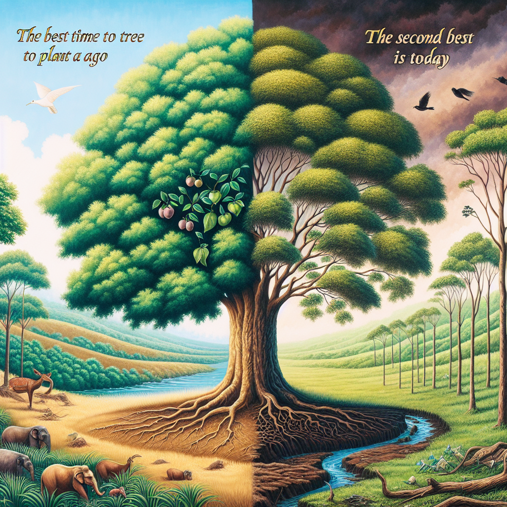

# ‘The best time to plant a tree was 25 years ago, the second best is today’

## AI Generated Summary

- President Ranil Wickremesinghe and Sri Lanka Podujana Peramuna Government pulled Sri Lanka out of a severe economic crisis.
- The government needs to focus on plant health, crucial for overall health and the planet's well-being.
- Village residents pay attention to plant health despite challenges like fertilizer shortages, unlike many city residents.
- UN's International Day of Plant Health on May 12 aims to raise awareness about protecting plant health to combat hunger, poverty, biodiversity loss, and environmental issues.
- Up to 40% of food crops are lost annually due to plant pests and diseases, affecting food security and rural incomes.
- Invasive pest species are a significant threat to biodiversity and can increase pesticide use, harming pollinators and natural pest enemies.
- FAO recommends environmentally friendly practices like integrated pest management and international phytosanitary measures in trade.
- Over 240 million containers move globally yearly, posing biosecurity risks, with invasive pests causing $220 billion in economic losses annually.
- Global collaboration and standards like electronic phytosanitary certification (ePhyto) are essential to protect plant health and secure trade.
- FAO urges governments to prioritize plant health to achieve Sustainable Development Goals, particularly Zero Hunger.
- Policies should address pest and disease outbreaks, promote sustainable pest and pesticide management, and ensure international compliance.
- Public awareness is crucial to prevent risks from bringing plants across borders and using e-commerce for plant products.
- Farmers should use certified pest-free seeds, monitor and report pests, and adopt eco-friendly pest management practices.
- NGOs and cooperatives can raise awareness and support farmers in implementing best practices for pest management.
- Emphasis on prioritizing plant health for long-term benefits reflected in quotes by Robert Louis Stevenson and Eliud Kipchoge.

## Original Text

[https://www.dailymirror.lk/opinion/The-best-time-to-plant-a-tree-was-25-years-ago-the-second-best-is-today/172-282335](https://www.dailymirror.lk/opinion/The-best-time-to-plant-a-tree-was-25-years-ago-the-second-best-is-today/172-282335)

*2024-05-11T00:00:00+05:30*

While President Ranil Wickremesinghe and the Sri Lanka Podujana Peramuna Government has pulled Sri Lanka out of one of its worst-ever economic crises, the Government also needs to give special attention to issues such as plant health. Most village folk give much-needed attention to plant health despite problems such as shortage of fertiliser; but city folk generally do not bother much about plant health as they consider planting a tree to be the job of a servant. But good citizens need to be concerned about plant health and related issues because our health and the health of our planet depend on plants.

On Sunday, May 12, the United Nations (UN) marks International Day of Plant Health, with the focus being to raise global awareness on how protecting plant health can help end hunger, reduce poverty, protect biodiversity and the environment, and boost economic development.

In a statement, the UN-affiliated Food and Agriculture Organisation (FAO) said that plants are life and we depend on them for 80 percent of the food we eat and 98 percent of the oxygen we breathe. Yet, each year, up to 40 percent of food crops are lost due to plant pests and diseases. This is affecting food security and agriculture, the main source of income for vulnerable rural communities. 

According to the FAO, invasive pest species are one of the main drivers of biodiversity loss that threaten the delicate web of life that sustains our planet. Pests and diseases have also been associated with rising temperatures which create new niches for pests to populate and spread. In response, the use of pesticides could increase. This harms pollinators, natural pest enemies and organisms crucial for a healthy environment. Protecting plant health is essential by promoting environmentally friendly practices such as integrated pest management. International standards for phytosanitary measures (ISPMs) in trade also help prevent the introduction and spread of plant pests across borders.

FAO stresses that each year, over 240 million containers move between countries, carrying goods including plant products, posing bio-security risks. In addition, about 80 percent of international trade consignments include wood packaging material, providing a pathway for pest transmission. As a result, damages from invasive pest species incur global economic losses of about USD 220 billion annually. Protecting plant health across borders is essential by promoting global collaboration and international standards, such as the ISPMs. Innovative solutions like electronic phytosanitary certification (ePhyto) streamline the process, making trade quicker and more secure. 

In a call to action, the FAO urges Governments, policymakers and legislators to prioritise plant health and protection, recognising that it is fundamental to achieving the 2030 Agenda, particularly Sustainable Development Goal 2: Zero Hunger. Policies and legislation need to address and prevent pest and disease outbreaks and promote sustainable pests and pesticide management, while strengthening monitoring and reporting, and facilitating safe trade. They should ensure compliance with international plant health standards, invest in plant-health innovations, research and capacity development and empower national and regional plant protection organisations. 

The FAO adds that people should be aware of the risks involved in bringing plants and plant products across borders that may harbour pests and diseases. We need to be careful when ordering plants and plant products through channels such as e-commerce with postal services that bypass regular phytosanitary controls.

The FAO states that farmers can prevent the spread of pests by using only certified pest-free seeds and seedlings; and regularly monitoring, controlling and reporting the occurrence of unusual pests on their farms. They should adopt environmentally friendly pest management practices–including those based on biological approaches that do not kill pollinators and use beneficial insects and organisms.

Additionally, FAO says that Non-Government Organisations and cooperatives working directly with farmers can raise awareness of best practices for preventing and managing pests; and provide them with practical support in implementing these practices. 

Scottish novelist and essayist Robert Louis Stevenson says, “Don’t judge each day by the harvest you reap but by the seeds that you plant.” Kenyan long-distance runner Eliud Kipchoge says, “The best time to plant a tree was 25 years ago. The second-best time to plant a tree is today.” Therefore, the Sri Lankan Government and its people should make it a point to prioritise plant health.

