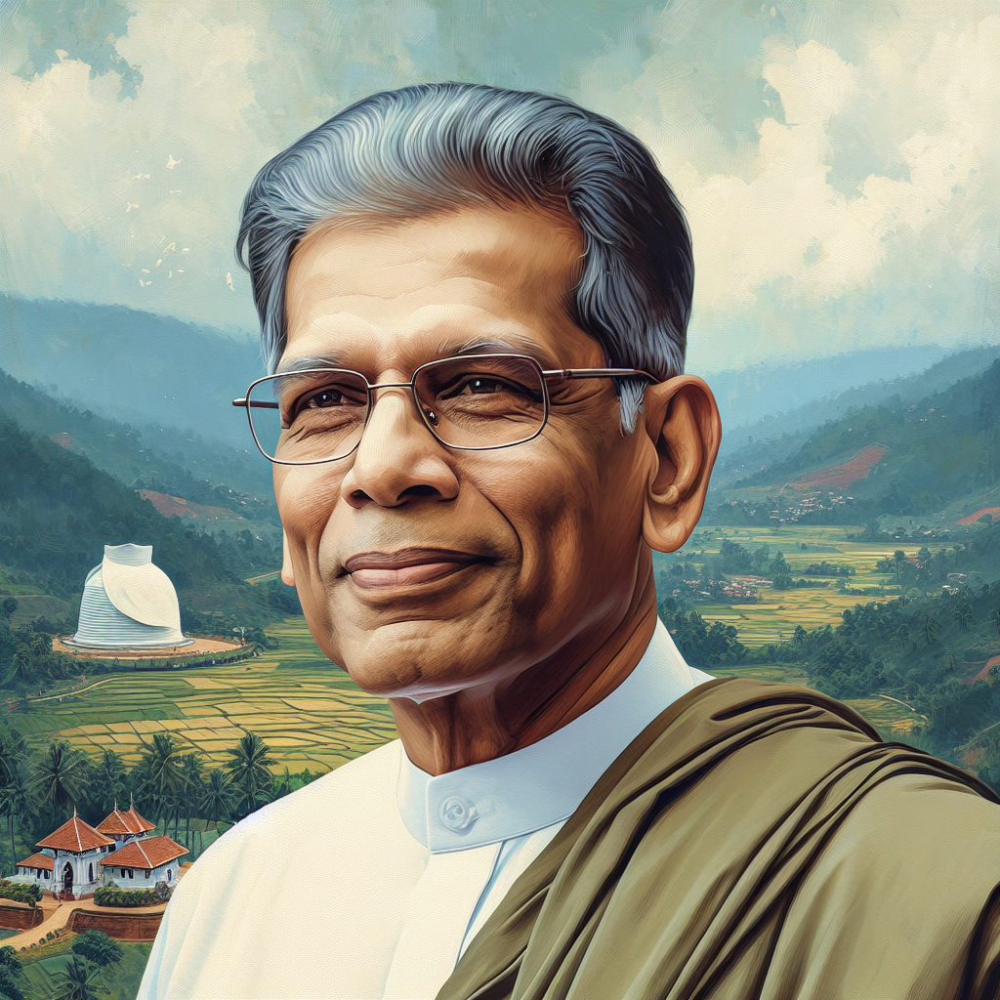

# 11th Commemoration of Dr. Ranjith Navarathne’s He was dedicated to social justice

## AI Generated Summary

- Dr. Ranjith Navarathne was a former leader of the Sri Lanka Mahajana Party and Kurunegala District Member of Parliament.
- The 11th commemoration of his passing was on May 1, marked by a memorial service on May 4.
- Born on January 07, 1948, in Nikawewa, North Western Province.
- Exhibited academic excellence and led student protests in university.
- Active in Lanka Sama Samaja Party’s Student Federation.
- Joined and later left the Janatha Vimukthi Peramuna (JVP), then joined Sri Lanka Freedom Party.
- Began his career as an English Assistant Teacher in 1975; served in education for 21 years.
- Faced political persecution during the UNP government tenure in 1977.
- Established youth organizations for the Sri Lanka Freedom Party with Anura Bandaranaike and Basil Rajapaksa.
- Actively supported Hector Kobbekaduwa in the 1982 presidential elections.
- Co-founded the Sri Lanka Mahajana Party in 1981, contributing to its organizational growth.
- Faced and resisted terror post-1988 and served in leadership roles within the Mahajana Party.
- Appointed Deputy Secretary in 1988 and Vice President in 1989 of the Mahajana Party.
- Significant role in forming the Sri Lanka Podujana Peramuna and the United People’s Freedom Alliance.
- Elected to Parliament in 2000 but not given a ministerial post.
- Led the formation of the United People’s Freedom Alliance in 2004 and worked under Mahinda Rajapaksa’s leadership from 2005.
- Chaired the Ceylon Ceramics Corporation and held consultant roles in the Ministry of Education.
- Recognized for contributions in education, politics, and arts; received honorary titles.
- Married Kamala Dissanayake in 1975 and dedicated 45 years to public service.
- Passed away on May 1, coinciding with Labor Day, remembered for his leadership and service.

## Original Text

[https://www.dailymirror.lk/opinion/11th-Commemoration-of-Dr-Ranjith-Navarathnes-He-was-dedicated-to-social-justice/172-282340](https://www.dailymirror.lk/opinion/11th-Commemoration-of-Dr-Ranjith-Navarathnes-He-was-dedicated-to-social-justice/172-282340)

*2024-05-11T00:00:00+05:30*

He was an active student leader of the Student Federation affiliated to the Lanka Sama Samaja Party

Dr. Ranjith Navarathne

This article is penned to mark the 11th Commemoration of the late Dr. Ranjith Navarathne, a former leader of the Sri Lanka Mahajana Party and former Kurunegala District Member of Parliament. The 11th commemoration of this individual fell on May 1 and a memorial service was held in his name on May 4. 

Born on January 07, 1948 in the beautiful village of Nikawewa in the historical Nikawagampaha Korale, Hiriala Hatpattuwa, North Western Province, Navarathne’s life experiences are parallel to the development of independent Sri Lanka. Choosing Sri Devanam Piyathissa Central College, Nikkewa for his education, he showed exceptional talent for education from an early age. In 1967, he passed his Advanced Level Examination with top honors and entered University.   

In 1965, he started his higher education by joining the then University of Ceylon (currently Colombo University). His university tenure marked a period where he led student protests. Here he had unique memories of a political journey. He was an active student leader of the Student Federation affiliated to the Lanka Sama Samaja Party.    

He joined the JVP not only to stand up against the social injustices he had to face in the era when he was looking for a job after graduating and was suffering from unemployment. He actively led the JVP rebellion that emerged in 1971. He led the armed group that suppressed the Maho police and was later imprisoned as a rebel in Kurunegala, Welikada and Polonnaruwa prisons. Although he joined JVP based on youth unrest, he later left the JVP ideology and joined the Sri Lanka Freedom Party and started his political journey.    

He started his professional career in 1975 as an English Assistant Teacher in the Department of Education. He later served the Department of Education for 21 years as a teacher and as a director of education.

With the U.N.P. government assuming power in 1977- which brought our country much disaster- a great violence was launched across the country. Dr. Navarathne, who was a leader of an opponent political journey, also had to face torture and persecution because of the same. He had to suffer political revenge. 

However, it is a known fact that he carried out a unique mission to establish the youth organizations of the Sri Lanka Freedom Party by going across the country with Anura Bandaranaike and Basil Rajapaksa in the face of UNP terror. Basil Rajapaksa, who was the Minister of Economic Development at the time, specifically mentioned it in his commemorative speech at a commemorative programme held at the Kurunegala Town Hall after his death.   

In the 1982 presidential elections, a great commitment was made by him to bring victory to Hector Kobbekaduwa, the candidate of Sri Lankan National Party. However, he was defeated as a result of a conspiracy launched within the Sri Lanka National Party itself.  

After this presidential election, he became one of the founding leaders of the Sri Lanka Mahajana Party, which was formed on January 22, 1981, with the split of Vijaya Kumarathunga and T.B.Ilangarathna and others. He made a great contribution to the parry to spread its tentacles nationwide. He was also a unique character among the talented orators that the Sri Lanka Mahajana Party had. On 16 February 1988, even after Vijaya Kumaratunga’s death, he did not waver and bravely faced the terror launched in 1988-89 with his comrades.

As a result of that, he was appointed to the post of Deputy Secretary of the party on 10 July 1988 and to the post of Vice President of the party on 12 November 1989.

The members of the Mahajana Party sacrificed their lives to establish the Provincial Council, which brought a solution to the ethnic crisis. 

At the time when the Mahajana Party was divided as Aussy and Y.P, the progressive camp was further strengthened by Dr. Nawarathne. 

He was the chairperson of Sri Lanka Mahajana Party who placed his signature to establish Sri Lanka Podujana Peramuna under the leadership of Sirimavo Dias Bandaranaike in 1993; breaking the right-wing rule. In 1994 Navarathne made a special contribution to the formation of a Podujana Eksath Peramuna government under the leadership of Mrs. Chandrika Bandaranaike Kumaratunga. 

The defeat of this person, who was a popular candidate in the Kurunegala district in the 1994 general election, is still unbelievable to us today. However, after the defeat, he fulfilled his political responsibility well, and in a few years, in the 1999 North-Western Provincial Council election, he won third place in the district. After receiving 50,000 votes from Kurunegala district in the election held in 2000, he was elected to Parliament, but not given a 

ministerial post.

Then in 2004, he took the leadership of the Mahajana Party to form the United People’s Freedom Alliance and fulfilled his historically assigned task. In 2005, under the leadership of Mahinda Rajapaksa, the people rallied again and he took the lead as a pilot in the struggle for a national development path against privatization, separatist war and foreign domination.

That is the reason why he was given the chairmanship of the Ceylon Ceramics Corporation. 

Due to Dr. Navarathne’s knowledge, skills and experience in the field of education, in addition to this responsibility, he was offered a consultant position in the Ministry of Education.

Dr. Navarathne was a philanthropist who excelled not only in politics but also in art and literature.

He was honored by social service institutions including Amarapura Mula Vamshika Maha Nikaya with honorary titles such as Education Chakravarthy and Professor on Education.

In 1975 he married Kamala Dissanayake.

As a dedicated politician, he was engaged in public service for 45 years. He guided the political course by backing the same policy until death took him away.

All of us paid our respects to the people’s leader who died on the same day when our Labors are remembered. 

Saman Rajapakse

Senior Lecturer 

Department of Mass Communication, 

University of Kelaniya

