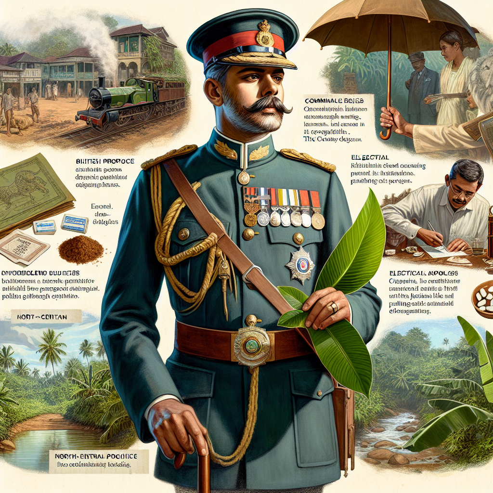

# Foreigner, Freeman forced out of Parliament 90 years ago First British passport holder elected to Parliament in 1924

## AI Generated Summary

- **Herbert Rayner Freeman**:
  - Born in March 1864.
  - Elected to Legislative Council (LG) under Colebrook Constitution in 1924, representing North-Central Province.
  - Served in Colonial Secretariat in Ceylon starting in 1885.
  - Retired in 1919 as Officer Class 1 of Ceylon Civil Service.
  - Actively engaged in community service, aiding the ill and advocating in court for the wrongly accused.

- **Community Commitment**:
  - Chose to remain in North-Central Province post-retirement and serve as a social worker.
  - Won Legislative Council election against D. S. Krisnaratne with significant voter support.
  - Elected again in 1931 to the first State Council under the Donoughmore Constitution.

- **Election and Public Service**:
  - Known for his jungle travels with an iconic umbrella.
  - Distributed medicines and agricultural equipment, communicated fluently in Sinhala.
  - Campaigned with a unique green beetle leaf symbol.

- **Electoral Reform Criticism**:
  - Advocated for the abolishment of National List, citing misuse by party leaders.
  - Criticized the appointment of individuals with dubious backgrounds, including terrorists and non-citizens.

- **Governance Evolution in Ceylon**:
  - Legislative body established in 1833, following Colebrooke-Cameron Commission's recommendations.
  - Replaced by the State Council in 1931, marking a shift in governance structures.

- **Parliamentary Incident in 1934**:
  - Freeman’s controversial remarks led to suspension from the Council for one week.
  - Refused to withdraw his words, resulting in a notable parliamentary exchange.
  - Utilized the suspension as an opportunity for a "nice holiday."

## Original Text

[https://www.dailymirror.lk/opinion/Foreigner-Freeman-forced-out-of-Parliament-90-years-ago-First-British-passport-holder-elected-to-Parliament-in-1924/172-282510](https://www.dailymirror.lk/opinion/Foreigner-Freeman-forced-out-of-Parliament-90-years-ago-First-British-passport-holder-elected-to-Parliament-in-1924/172-282510)

*2024-05-14T00:00:00+05:30*

Born in March 1864, Herbert Rayner Freeman was elected to the Legislative Council-(LG) under the Colebrook Constitution in 1924, representing the North-Central Province

Freeman was known to traverse miles along jungle trails, visiting the ill and those in need, always carrying his iconic umbrella. Remarkably, he even attended court sessions to advocate for individuals he believed had been unfairly accused in criminal cases

Abolish the National List; empower the electorate to choose their representatives. The current system is flawed, with party leaders and secretaries often lacking insight. They appoint individuals with dubious backgrounds, including terrorists and non-citizens, merely for financial gain. This practice undermines the credibility of our democratic principles and turns them into a farce. Let’s restore integrity to our electoral process by allowing people to have a direct say in who represents them.

Born in March 1864, Herbert Rayner Freeman was elected to the Legislative Council-(LG) under the Colebrook Constitution in 1924, representing the North-Central Province. Commencing his career with an appointment in the Colonial Secretariat in Ceylon in 1885, Freeman retired in 1919 upon reaching the age of 55, having served as an Officer Class 1 of the Ceylon Civil Service. His final posting, spanning five and a half years, was as the Government Agent in the North-Central Province.

Committed to local community 

Freeman, however, remained committed to his local community in the North-Central Province (NCP). Despite having the option to return to England and draw his pension, he chose to stay and serve as a social worker for five years. Eventually, he contested the Legislative Council election against his opponent, D. S. Krisnaratne, a lawyer and incumbent member. Interestingly, although Krisnaratne was Sinhalese and the electorate comprised 94% Sinhala-Buddhists, he also lost his deposit. This outcome suggests that the electorate, despite having a relatively low literacy rate of 30%, was not swayed by racial or religious biases at that time. When the election results were announced, Freeman, the British citizen emerged victorious with a significant margin, garnering around 8000 votes compared to his contender’s mere 800. On September 12, 1924, his triumph was officially confirmed as he was declared the elected member of the Legislative Council, representing the North Central Province.

Freeman was known to traverse miles along jungle trails, visiting the ill and those in need, always carrying his iconic umbrella. Remarkably, he even attended court sessions to advocate for individuals he believed had been unfairly accused in criminal cases. Freeman, a figure of some controversy, later returned unopposed from Anuradhapura to the first State Council in 1931 under the Donoughmore Constitution, a testament to the gratitude, affection, and respect the peasants held for him, affectionately known as “Eajantha Hamuduruwo.” 

Representative government 

The legislative body of Ceylon, established in 1833, marked the island’s initial venture into representative government, following the recommendations of the Colebrooke-Cameron Commission. This body served as the precursor to modern governance structures, representing an early milestone in the island’s political evolution. However, it was later replaced by the State Council of Ceylon under the 1931 Donoughmore Constitution. This transition marked a significant shift in the island’s governance framework, reflecting changing political ideologies and aspirations.

He actively engaged in community service, distributing medicines to the sick and providing agricultural equipment to farmers. Taking moments to rest under the shade of a tree at a jungle trail junction, he would gather villagers around him, addressing them fluently in Sinhala, despite being of European descent.

“Umbalawa chanda polata geniyanne mata behe. Umbala gihin mage kola paata pettiyata kole dammoth mama dinanawa. Nethnam mama engalantheta yanawa,”

Meaning, ‘I am unable to provide transport for you to go and cast your vote. If you find your way and cast your vote for me in my green box, I will win, or if I lose, I will sail back to England.’ He toured the entire province, a place he knew intimately, donning a tropical hat adorned with a green beetle leaf affixed to its side.

Literacy rate 

During that period, the literacy rate was indeed relatively low. In 1924, and up until 1947, the voting process did not involve marking a ballot paper. Eligible adults cast their votes by selecting the colored box allocated to each candidate. Some candidates utilized symbols for campaigning purposes. Freeman opted for the beetle leaf as his symbol, accompanied by the color green for his designated box. Conversely, his opponent employed a red-colored box.

The Council’s members convened in the building situated on Janadhipathi Mawatha, Colombo Fort, which later accommodated the Senate and is currently utilized by the Foreign Ministry. The Governor presided over the proceedings, with all top government officials serving as members. Additionally, six unofficial members were nominated by the Governor, three to represent the Europeans and three to represent the Ceylonese population. However, these nominated members lacked the authority to introduce legislation; their role was confined to contributing to discussions. Nonetheless, this marked the initial stride towards granting citizens a voice in the administration of the island.

While perusing the pages of an old Hansard of the 1930s, the reader stumbled upon a noteworthy observation regarding the conduct of the controversial member in Parliament during September 1934. Extracts from the Hansard dated September 13, 1934: Folio 2473 to 2480, shed light on Freeman’s actions and remarks within the parliamentary setting. Freeman—[Elected member for Anuradhapura]  “…better to dissolve the Council than to go on selling its honour by intrigues worthy of the Artful Dodger of the classical fiction.

The Chairman: …The honourable member must withdraw that word.

 Freeman: I used it deliberately.

Members: Withdraw!

Freeman : No sir, send me out of the Council.

The Chairman: You must withdraw. You can’t attribute such intrigue to members of the Council.

Freeman : Send me out. I am prepared to go.

SWRD Bandaranaike: I think if the Hon. member is permitted to explain what he means, it would be clear to members that he does not mean…let him explain the meaning of the word “ramp”

Freeman : look it up in the dictionary.

Chairman: well, action might be taken.

Hon D B Jayatillake: I move that the Hon member for Anuradhapura be suspended from the session, before I put it to the House I ask the Hon member to withdraw the words—he has the honour of the House as much at heart  as any other member. Does he still persist in using that phrase? 

Freeman :  I have explained it. I said that I referred to the events of March 23 which I described as “r-a-m-p”, and that is the  implication all the way through. Nothing else.

 Chairman: But what about these words?

 Hon D S Senanayake: I believe there is a proposal before the House and the proposal is seconded.

The Chairman: before I put it to the House I would ask the Member even now to withdraw the objectionable words and phrase.

Freeman :  I am not withdrawing anything.

Hon DSS; I second it, Sir.

 Chairman: The hon. member shall be suspended for one week.

 Freeman :  That is a nice holiday for me.    

kksperera1@gmail.com 

