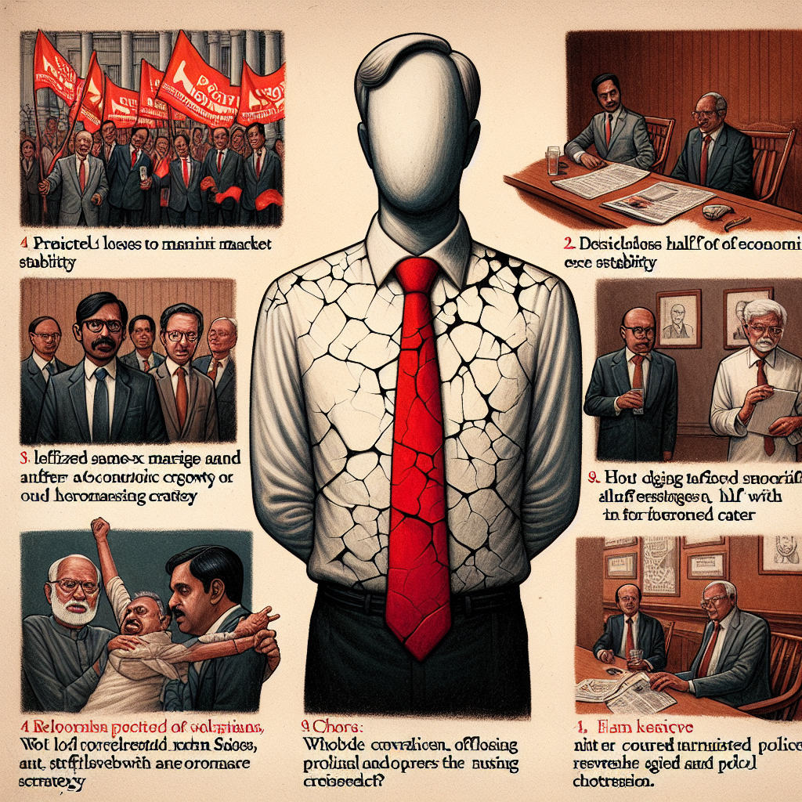

# The rise and fall  of South Asian leaders in Britain and Ireland

## AI Generated Summary

- **Rishi Sunak’s Conservative Party**: Predicted to face significant losses in upcoming parliamentary elections.
  - The local council elections on May 2 indicated waning support.
  - Conservative Party lost half of their 1,000 defended seats and experienced further losses in a parliamentary by-election and mayoral contests.
  - Sunak praised for market stability but criticized for lack of economic growth strategy and failing promises regarding NHS and asylum handling.
  - Conservative Home poll: 63% of Tory members want Sunak to lead through the elections.

- **Leo Varadkar**: Former Taoiseach (Irish Prime Minister).
  - Two-time Taoiseach, resigned in March 2024.
  - Legalized same-sex marriage and lifted the abortion ban during tenure.
  - Struggled with housing crisis and failed constitutional modernization referendum.
  - Speculated to seek a high-profile EU job, with potential support from the European People’s Party.

- **Humza Yousaf**: Former First Minister of Scotland.
  - Held various ministerial roles before becoming First Minister in March 2023.
  - Resigned in May 2024 after controversies and policy setbacks.
  - Postponed deposit return scheme, abandoned marine protection proposals, and lost a high-profile gender recognition reform case.
  - Called for Gaza ceasefire, but lost political support after ending power-sharing agreement with Greens.

- **Influence of South Asians**: Declining at the highest political levels in the British Isles.
  - Notable South Asian-origin leaders: Rishi Sunak (UK PM), Humza Yousaf (Scotland’s First Minister), Leo Varadkar (Ireland’s Taoiseach).
  - Varadkar possibly aiming for a significant European Union role.

## Original Text

[https://www.dailymirror.lk/opinion/The-rise-and-fall-of-South-Asian-leaders-in-Britain-and-Ireland/172-282512](https://www.dailymirror.lk/opinion/The-rise-and-fall-of-South-Asian-leaders-in-Britain-and-Ireland/172-282512)

*2024-05-14T00:00:00+05:30*

According to the website www.politico.com Rishi Sunak’s Conservative  party is “marching inexorably towards annihilation” in  the next  parliamentary elections expected to be held either at the end of this  year or January 2025. This is indicated in the results of the local  council elections held throughout the UK on May 2

The influence of South Asians at the highest political levels in the  British Isles appears to be on the wane. However, there is speculation  that Leo Varadkar might take up a top job in the European Union and  become the first person of part-Indian origin to do so

But Varadkar could not solve Ireland’s acute housing problem. Under both  terms as Taoiseach, he failed to hit targets for affordable housing. A  whole generation of young voters were unable to purchase homes

Leo Varadkar and Humza Yousaf have resigned and Rishi Sunak is shaky  

An extraordinary change had taken place in Great Britain and Ireland in the recent past. Persons from the erstwhile British Empire entered British politics, became MPs and Ministers and a few rose to be heads of government. These events changed the racial and political profile of the former imperial power.

In 2017, Leo Varadkar (45), part Irish and party Indian, became the Taoiseach (Prime Minister) of Ireland for the first time. In 2022, he became Taoiseach for the second time. In October 2022, Rishi Sunak (44) became the first Indian-origin Prime Minister of the UK. Humza Yousaf (39) from Pakistan, became the First Minister (Chief Minister) of Scotland in March 2023.        

However, both Varadkar and Yousaf had to resign from their posts, Varadkar going in April 2024 and Yousaf in May.  Rishi Sunak is still hanging on, but his position is shaky as his leadership qualities are being questioned both within and outside his Conservative Party.

The influence of South Asians at the highest political levels in the British Isles appears to be on the wane. However, there is speculation that Leo Varadkar might take up a top job in the European Union and become the first person of part-Indian origin to do so. 

Rishi Sunak

According to the website www.politico.com Rishi Sunak’s Conservative party is “marching inexorably towards annihilation” in  the next parliamentary elections expected to be held either at the end of this year or January 2025. This is indicated in the results of the local council elections held throughout the UK on May 2. 

The Conservatives lost half of the 1,000 seats they were defending. They also lost a parliamentary by-election and won only one of the 11 mayoral contests.

Sunak is praised for steadying the markets and restoring Britain’s financial credibility, but he has failed to follow this up with a convincing strategy to boost economic growth. Nor has he fulfilled  a promise to cut the waiting period in the National Health Service and stop boats carrying asylum seekers to the UK, the New York Times said.

Conservatives would like Sunak to announce schemes that would kindle hope among them but none has come up so far. The result: the opposition Labour Party has had a steady 20% lead in opinion polls.   

However, a Conservative Home poll cited by The Guardian found that 63% of Tory members did not think Sunak should resign now. He should lead the party through the coming parliamentary elections, the respondents said.

Humza Yousaf 

In Scotland, Humza Yousaf, a man of Pakistani origin belonging to the Scottish Nationalist Party (SNP), became Scotland’s First Minister in March 2023. But he had to go in May 2024. 

When Yousaf was Transport Minister earlier, he was attacked over the performance of ScotRail. When he was Justice Minister, his “hate crime bill” got mired in controversy over fears that the new offence of “stirring up hatred” could have a major impact on the freedom of speech.

Yousaf’s year as First Minister saw the postponement of a controversial deposit return scheme, which had been led by the Greens, the Scottish Nationalist Party’s political ally. Proposals for highly protected marine areas were also ditched. 

The Scottish government did not go to the Supreme Court to challenge the UK government’s blocking the gender recognition reforms. It lost the case, and the legislation was shelved. The Scottish Gender Recognition Reform Bill was meant to amend the Gender Recognition Act 2004 of the UK Parliament, making it simpler for people to change their legal gender. 

Yousaf took a significant stand on Gaza by calling for an immediate ceasefire. 

However, his decision to abandon the power-sharing agreement with the Scottish Greens, was a big blunder. It led to his downfall. The Greens said that Yousaf would have to go and he did.

Ireland

Leo Varadkar, who is part Irish, party Indian, had two terms as Prime Minister (or Taoiseach in Irish), the first from 2017 to 2020 and the second from 2022 to 2024. In March this year, he resigned unexpectedly.

During his tenure, Ireland managed to shed some of the conservative societal norms propagated by the Catholic Church through referendums. Same-sex marriage was legalized and the ban on abortion was lifted. 

But Varadkar’s attempt to modernise references to family and women in the country’s constitution, through a dual referendum, resulted in a humiliating defeat.  The first question in the referendum was about permission to widen the definition of family. The government proposed to define the family as any “durable relationship” whether by marriage or not. By this definition, gay couples could consider themselves as family. Varadkar is openly gay.  

Varadkar scored a significant victory with his handling of the Brexit saga. While Ireland was part of the European Union, the UK wasn’t’. This created problems, especially Ireland’s relations with North Ireland, which is part of the UK. But these issues were solved. 

But Varadkar could not solve Ireland’s acute housing problem. Under both terms as Taoiseach, he failed to hit targets for affordable housing. A whole generation of young voters were unable to purchase homes.

High profile job 

There is speculation about why Varadkar resigned when there was no pressure on him to go. According to www.theconversation.com  Varadkar may go for a high profile job in the European Union. The upcoming European elections might offer opportunities if some of the highest positions in Europe come up for grabs.

The website said that the European elections are expected to result in the centre-right European People’s Party (EPP) winning the most seats, a group which includes Varadkar’s party the Fine Gael. Often the EPP gets a chance to appoint someone to the role of president of the European Commission (the president does not have to be an MEP).

“Since 2019 that role (of EU President) has been held by a German, Ursula von der Leyen of the EPP, who was backed for the job by compatriot Angela Merkel, also of the EPP. However, much has changed since. Germany is now led by Olaf Scholz whose party is in the centre-left Socialists and Democrats group and he may not want a national rival holding such a high-profile post. Similarly, other EU countries may prefer a non-German leader as countries compete for positions and are wary of too much power resting with France and Germany,” www.theconversation.com says.

Further: “Ireland has never had a Commission President and is one of just nine EU countries currently led by the EPP. Conveniently for Ireland, this short list does not include European heavyweights France, Germany, Italy or Spain. If it plays its cards right, Fine Gael could leverage itself as the compromise option for that post.”

“It would be unwise to make firm predictions here, particularly as Poland and Sweden are led by EPP members – but this would be ideal for Fine Gael.”

“Varadkar’s claim to have no interest in an EU role should be taken with a large pinch of salt. He can’t openly campaign against Von der Leyen but in reality, few politicians would turn down a chance to take her job,” www.theconversation.com says.

