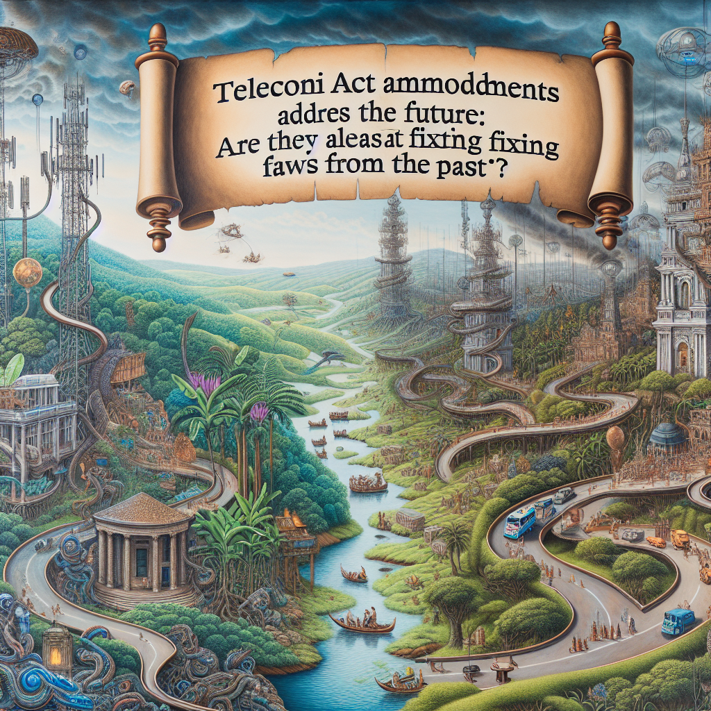

# Telecom Act amendments don’t address the future: Are they at least fixing flaws from the past?

## AI Generated Summary

The article discusses the rapid technological and infrastructural changes occurring in the country and questions whether current telecommunications laws are future-oriented and adequate to address these changes. It highlights the inadequacies in the proposed amendments to the Sri Lanka Telecommunications Act of 1991, pointing out gaps in addressing consumer rights, jurisdictional clarity, and competition regulation. The author criticizes the Telecom Regulatory Commission (TRC) for its structural and credibility issues, including inappropriate compensation packages, lack of independence, and susceptibility to political interference. The article underscores the need for broad consultations and proper drafting of laws to ensure they are comprehensive and effective. The author suggests that the proposed bill should be withdrawn and re-drafted with substantial public and expert input to better secure the digital future of the country.

## Original Text

[https://www.ft.lk/columns/Telecom-Act-amendments-don-t-address-the-future-Are-they-at-least-fixing-flaws-from-the-past/4-761833](https://www.ft.lk/columns/Telecom-Act-amendments-don-t-address-the-future-Are-they-at-least-fixing-flaws-from-the-past/4-761833)

*2024-05-16 00:40:44*

Our digital future is too important for half-baked legislation 

The country is changing. Apartments and condominiums are popping up everywhere. Technology and markets are changing. Navigating the streets without Google maps seems unthinkable. Data consumed in a month 25 years ago is now consumed in a few hours. 

The world is changing. Stories about vehicles that are communicating our braking patterns back to the manufacturer and insurance companies do not seem like science fiction, though we know our cars (and our insurance companies) are not like that, yet. 

The future is already here; it’s just not very evenly distributed, as William Gibson, the writer, says. Are our laws ready for the future? Are they at least adequate for the present?

Are the amendments future-oriented?

Not long ago, it was so difficult to get a phone connection that sometimes the only way was to buy a house that already had one. That past is thankfully behind us. The questions now are whether an apartment owner has the right to obtain fibre connectivity from any provider, or whether that choice is constrained by exclusive contracts signed by the builders or managers. If only one company has the right to lay fibre what are safeguards for consumers? What are the legitimate conditions that may be imposed? 

As our data use and that of our devices increases, the rights to erect antennae on street furniture (such as lamp posts), the rights to pull fibre right up to the lamp posts or benches, and the right to supply electricity to the unobtrusive antennae on the furniture will become critical for operators. If these matters are not dealt with through law and regulation, our cities will not be smart and the services we get will be suboptimal. Telecom is under the authority of the central government; city streets are governed by local government authorities that are under the Provincial Councils. Jurisdictional clarity and coordination have to be provided by law.

The above examples do not describe our digital futures fully. But it is reasonable to ask whether the substantive amendments being made after three decades to the Sri Lanka Telecommunications Act, No. 25 of 1991 will provide solutions to problems like them. Sadly, the published amendments do not.

Someone has done well to point out the gaps in the law relevant to safeguarding submarine cables at their vulnerable points, as they come ashore from the deep ocean. But there should have been some thinking on the economic and competitive aspects of the problem too. Up until the turn of the century, it was common wisdom that cable landing stations were essential facilities, defined as elements that are prohibitively expensive to duplicate but which are essential for the provision of a service.

Based on this thinking, the Telecommunications Regulatory Commission (TRC) tried in 2003 to prescribe regulations for multiple operators to use the existing cable landing stations on fair terms. But one of the most competition-friendly regulatory agencies, Hong Kong’s OFCA, did not consider cable landing stations essential facilities and was encouraging multiple landings by providing inexpensive land in the interests of redundancy. I am not promoting either view but asking whether the drafters have considered the two approaches and made adequate legal provisions for the problems that may arise depending on the choice. It appears such matters have been beyond their ken. However, some competition-specific powers and duties that are introduced in s. 3 and the new general competition provisions of the bill may allow a creative commission to act on essential facilities.

Are the amendments remedying the flaws?

The identities and qualifications of the drafters are not public knowledge. But we can assume that they had the benefit of advice from officials of the TRC. The actual text suggests either that the advice was not given, or that it was ignored. If the former, it is a question of capacity. If the latter, it is a question of the commission lacking credibility.

One may argue that the cause is not in the individuals, but in the organisational structure or perhaps in the compensation packages given to the officers. These flaws were known before I became Director General in 1998. In a non-transferable, pyramidal organisational structure such as the one found at the TRC career progression is naturally constrained. The pyramid gets narrower at the top. 

I explored the possibility of moving staff between regulatory agencies, but that went nowhere. The salaries and cadre commission turned down the salary proposal made by the then ministry secretary/chairman of the commission. The commission offered the employees generous, and then unprecedented for a state organisation, private health benefits to make up for the loss. But these problems may have contributed to the low esteem that the commission is currently held in or its lack of capacity, as manifested by the quality of the proposed legislation.

Do the amendments address these structural problems? The compensation packages of officials of the Central Bank and the Attorney General’s Department show that resistance to compensation commensurate with qualifications and responsibilities can be overcome. It’s not that the TRC lacks the funds. It brought in Rs. 15.5 billion on average each year over the past 10 years. 

The Central Bank of Sri Lanka Act, No. 16 of 2023, and the Anti-Corruption Act, No. 9 of 2023, contain provisions to pay appropriate salaries. Most of the senior personnel are now close to retirement. It would be good to be able to attract high-quality officers. Why does this bill not have the enabling provisions? Is it because the government wants to keep muddling through with a mediocre commission?

The landmark decision, Athukorale and others v Attorney General ((1997) 2 BHRC 610), stated that radio frequency spectrum was a public resource implicated in the exercise of fundamental rights and that therefore it had to be managed by an independent body, insulated from political interference. Even more than in the 1990s, the Telecom Regulatory Commission is involved in decisions that affect fundamental rights, issuing opaque, ex parte orders to shut down the Internet and to block websites. 

The Government volunteered to obtain Constitutional Council approval for the members of the Online Safety Commission, which is a less important and less powerful body than the TRC. Why are the appointment procedures of the Members of the TRC untouched by the amendments? 

The Chairman of the Commission is ex officio the Secretary of the Ministry the President chooses to place the TRC under. Under Gotabaya Rajapaksa, the Chairman was a retired General who served as Secretary of the Ministry of Defence. The Chairman can be appointed and removed by the political authority with no reasons given. 

The only full-time member of the Commission is the Director General. He/she serves at the pleasure of the Minister. No reasons need to be given for removal. Reasons have to be given for the removal of the other three members, but not when they are nudged to resign. There has been enormous churn at the top since 2000, but no one was actually removed. Even if independence is not that important, stability should be. 

Infirmity of the decision-making body is problematic in another sense. For example, the proposed new competition powers given to the Commission by s. 8 of the bill allow it to “make an appropriate order abating the existence of any such situation and for the purpose of remedying or preventing the resulting adverse effects thereof,” the situations being specified anti-competitive practices, including mergers. Will the Supreme Court as the guardian of the Constitution and the judicial power of the people exercised by the courts allow such a politicised body to exercise extensive powers such as orders to demerge that are usually reserved for judicial authorities?

There is a problem with the fund of the Commission, as evidenced by Rs. 600 million being given by the Chairman and Director General subject to “covering approval” by the Commission for purchasing sil redi just before an election. This appears, on the face, to be a weakness that an amendment should attempt to remedy. Purchasing items of religious material branded with the visage of a candidate does not seem to fall legitimately within the powers and duties of a telecom regulatory commission. But it happened. Two individuals were found guilty by the High Court though the verdict was successfully appealed. 

Respect for the law means that one should not relitigate matters decided by the highest court. But there is a strong case for changing the legal provisions and internal procedures to preclude a recurrence. The amendment was that opportunity. Sadly, that was another opportunity missed.

I could go on. But these examples should suffice, for now. 

What should be done?

In a rapidly changing sector (telecom now involves more than just telecom operators), knowledge is not the monopoly of officials or regulators. It is widely dispersed. That is why new laws in sectors like this are made through broad consultations. Even though the Personal Data Protection Act (No. 9 of 2022) still has some imperfections, it was considerably improved since the first framework was opened for public comments. The Cyber Security text was opened for consultation again under the current dispensation. This is the first time the Telecom Act amendments have been made public. Now that it has been presented in Parliament, is there time to make substantive changes? 

The State Minister should withdraw this bill from consideration as was done by his Cabinet colleagues on several occasions. Even if the rigid rules of the Legal Draftsman’s Department do not allow for public consultations, there are provisions in the Sri Lanka Telecommunication Act that allow for public consultations and public-notice proceedings. The Minister’s own Ministry has experience in conducting consultations. They should be done, and the drafting done right.

Our digital future is too important for half-baked legislation. 

