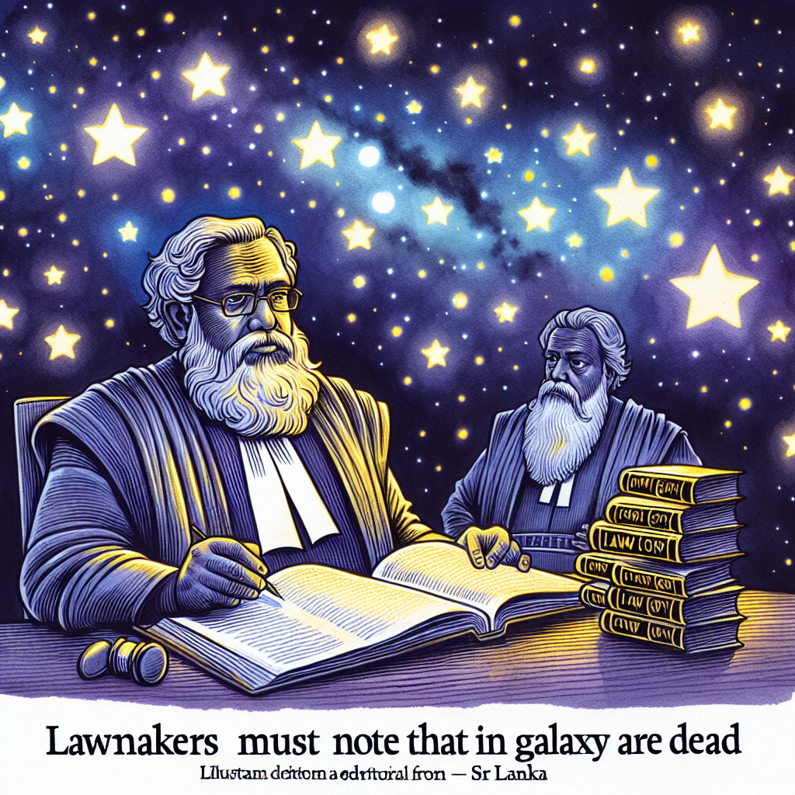

# Lawmakers must note that stars in galaxy are dead - EDITORIAL

## AI Generated Summary

The article discusses the current political and economic situation in Sri Lanka, highlighting the internal divisions and challenges the country faces. It reflects on the two-year anniversary of the ‘Aragalaya’ protests, which were primarily centered around Colombo and called for political change. Despite recent economic improvements credited to the current president from the ‘Green Grand-old Party,’ the regime is criticized for suppressing dissent and its handling of the economy, which remains fragile due to substantial debts and inflating costs. The article points out the government's focus on traditional exports without exploring modern markets, and criticizes leaders for failing to genuinely engage with the youth, who are future voters. It questions whether Sri Lanka requires new elections or more protests, indicating that the regime fears both. The article concludes by expressing nostalgia for the protest movement and connects current challenges to the past actions and inactions of the government.

## Original Text

[https://www.dailymirror.lk/opinion/Lawmakers-must-note-that-stars-in-galaxy-are-dead-EDITORIAL/172-282772](https://www.dailymirror.lk/opinion/Lawmakers-must-note-that-stars-in-galaxy-are-dead-EDITORIAL/172-282772)

*2024-05-17T00:59:00+05:30*

Sri Lanka is divided politically at present. Many years ago this country was divided in terms of race. Politics seems to be the cause of all this evil. Now we are told to prepare for a presidential election which is expected this year.   

Exactly eight days ago (May 9) people of this country were reminded that two years had passed after the ‘Aragalaya’ (Protest) took place. Largely these protests were held in and around Colombo; some protests took place in other places outside Western province, but not with the same aggression and success. Talking about Colombo, there is a hotel put up near Galle Face, where the main protest took place. That hotel was opened on April 24 (2024) and among the invitees and special guests were individuals who the protesters wanted out of politics. 

The head of state, speaking at the occasion, had opined that the people of this country shouldn’t return to protest action. He had instead requested the people to help in the government’s efforts to rebuild the country’s economy. This is a fair call by the president. But he has not been very fair about the protest and protesters. This attitude of the government can be seen quite frequently by observing how it squashes even the slightest attempt by the people made in the name of descent.   

However, there are still large numbers in this country who prefer this leader from the ‘Green Grand-old Party’. He is credited for the small economic revival that the regime claims has taken place and boasts of. His detractors, however, maintain that the island’s economy is still on life-support; given the heavy loans to be settled by the Government and the rising cost of goods.   

This regime talks much about increasing domestic produce and venturing into untapped foreign markets. But the Opposition has a different view on how this government-like most of the past ones has fared. The Comrade, known for spending lavishly on expensive attire, has blamed all regimes and this present one for being unable to think beyond the traditional export commodities such as tea, rubber and coconut. Our leaders have always stopped to boast of our heritage and rich history. During that time, of cherishing nostalgic memories, the rest of the world has overtaken us.   

The president spent much time during the recent past to mingle with youth and schoolchildren. When he exchanged ideas with them it was obvious that he was attempting to influence their thinking rather than obtain feedback from the next generation. This generation will eventually form the future vote base. Leaders of this country must be aware that the present youth of this nation are pursuing not only education, but also opportunities to earn while they learn. Leaders must dump the old habit of listening only with the motive of rattling away with their own opinions. Leaders must listen to grievances with the motive of offering solutions.   

A person might pop the question, ‘Do we need an election or a second Protest’. According to the pulse of political analysts, the present regime fears both. The one-time most popular politician in this country-who was even compared to King Dutugemunu-has recently put out a press release through which he has shown concern regarding the government’s plans to sell national assets. A handful among the present-day lawmakers forming the Cabinet is ‘stars’. They get invited to attend special functions. But they must take note like the scientific take on the stars in the galaxy; and that is the fact that all of them are dead. The majority of our lawmakers are well passed retirement age.   

Now it’s not an era of ‘stars’. Now it’s the era where those who are at the end of their tether are refusing to embrace death and instead have chosen to live. These are days where there is enough rain to wet the soil and wash away the dust from the Colombo roads. But the fragrance and memories of the ‘protest’ on the Colombo streets remain.   

