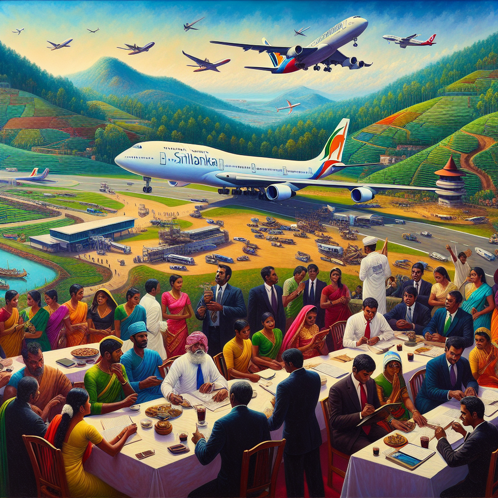

# Restructure SriLankan Airlines – but no mandate for sale

## AI Generated Summary

The article discusses former President Mahinda Rajapaksa's statement on restructuring State-Owned Enterprises (SOEs), causing controversy and criticism, particularly from Ranga Jayasuriya in the Daily Mirror. Jayasuriya's focus on SriLankan Airlines is challenged with contrasting financial data, showing a significant reduction in losses and even a potential turnaround to profitability. The article criticizes Jayasuriya for misleading the public and revisits the struggles of global airlines, highlighting that making losses is part of the industry, not unique to SriLankan Airlines.

Historical references, such as the closure of Swissair and the struggles of Malaysian Airlines, underscore the point that maintaining a national carrier is inherently challenging, regardless of ownership. The article defends keeping SriLankan Airlines under state control, especially for national interests, and criticizes the idea of hastily selling SOEs without public mandate and proper elections.

Rajapaksa's statement underscores the need for innovative restructuring rather than privatization, aligning with the people's mandate from past elections. The article calls for any plans to sell SOEs to be postponed until elections are held, allowing the public to decide on such matters through a democratic process.

## Original Text

[https://www.ft.lk/columns/Restructure-SriLankan-Airlines-but-no-mandate-for-sale/4-761891](https://www.ft.lk/columns/Restructure-SriLankan-Airlines-but-no-mandate-for-sale/4-761891)

*2024-05-17 00:24:03*

Mahinda Rajapaksa

Former President Mahinda Rajapaksa’s official statement on the issue of the restructuring of State-Owned Enterprises (SOEs) has driven the usual suspects into a fit of rage. Instead of addressing the content of the statement through facts and rational argument, one Ranga Jayasuriya has gone on a hate-spewing tirade on Daily Mirror. Let us keep aside all the ad hominem fallacies in his article, including childish name-calling, fear-mongering and false accusations. Such immature personal attacks only support Mahinda’s stance.

Although Mahinda Rajapaksa speaks about all SOEs in general, Jayasuriya seems to have read it as impacting only SriLankan Airlines. Perhaps it is not because he has any money to be made in the proposed sale of the national carrier but because of his undying passion for turning loss-making SOEs into profit-making Privately-Owned Enterprises (POWs) in Sri Lanka… But let us look at his claims logically.

He claims that SriLankan Airlines has incurred a total loss of Rs. 400 billion to date (Daily Mirror). However, Daily FT says, “SriLankan Airlines incurred Rs. 601.7 billion as of 31 March 2023.” If Jayasuriya’s claim is valid, the SOE has reduced its overall loss by over Rs. 200 billion over the past year. That’s a considerable achievement. If the trend continues YoY without any external threat, the airline should be able to turn profitable in two years. 

Misleading the public

Jayasuriya talks about politicians trying to mislead the public, but sadly, he is the one using these broad, irrational financial claims without proper investigation and responsible reporting. In fact, according to audited statements, “SriLankan Airlines has reported a group loss of Rs. 71.3 billion, down from Rs. 163.5 billion in FY22. However, excluding foreign exchange loss, the group posted an operating profit of Rs. 43.3 billion against Rs.1.6 billion in FY22” (Daily FT).

According to McKinsey and IATA, “The airline sector produced an economic loss of a whopping USD 175 billion in 2020 (10 times larger than the average annual value destruction pre-pandemic) and USD 104 billion in 2021.” When a professional journalist analyses these complicated matters, he/she must study the context in detail.  Furthermore, “the global airlines weren’t doing particularly well before the pandemic either. From 2012 to 2019, despite a favourable environment of strong economic growth and low fuel prices, airlines were bleeding USD 17 billion in economic profit a year, on average. Of the 122 carriers we studied, 77 per cent were value destroyers” (McKinsey & Company). Professional financial analysts understand that when the global airline sector made such massive losses before and during the pandemic, it is childish to expect SriLankan Airlines to be any different.

Swissair closure

This is not new news. Maintaining a national carrier is an expensive affair for any country. Whether owned and operated by the state or the private sector, there are ample examples of airlines making huge losses and even closing down entirely. One of the famous examples I teach for MBA students is the case of Swissair. Jayasuriya, in his article, degrades Sri Lanka and refers to “this part of the world” as being inferior to possibly the global north, which is not a surprise because most of these haters-of-everything-Lankan have no or limited education outside of Sri Lanka. 

Swissair was Switzerland’s pride in the sky, dubbed “The Flying Bank,” a reference to its infamous banks, through which the world’s most corrupt businesses launder their money. And it was privately owned. Yet it went out of business due to multi-million-pound losses primarily due to mismanagement. Out of national shame, the Swiss started another private airline called Swiss International Airlines, which also failed to make any profit and was sold off to Lufthansa in just two years (BBC). I wonder which “part” of Jayasuriya’s world is Switzerland in… 

There are many more such examples from all around the world. Jayasuriya says that SriLankan Airlines is now without a credible buyer. However, according to Daily FT, “Malaysia’s multinational budget carrier AirAsia, diversified blue chip Hayleys Plc and Fits Air are among six parties vying for Sri Lankan Airlines.” We ask the writer whether these organisations are not “credible”, and if so, why?

What is restructuring?

Speaking of Malaysia, their national flag carrier, Malaysian Airlines, was announced “technically bankrupt” in 2015. It made YoY losses for 10 years until it made a profit in 2023. Their budget airline, AirAsia, which is interested in buying SriLankan Airlines, lost 3.3 billion ringgits in 2022 (The Star). Are these also run by crooks, in Jayasuriya’s words? 

Making losses is part of doing business. What we need to do is not sell off the burden to ease the pain in the short term but innovatively restructure the business. That was the mandate the people gave in 2019 and again in 2020. That was the task Gotabaya Rajapaksa gave to the current leadership of SriLankan Airlines. Restructuring is not “selling” the enterprise to somebody else in haste. That’s the point being made by Mahinda Rajapaksa in his statement. We should think innovatively to change our products and services and the business model altogether to meet the current market opportunities and future trends. If you want to simply sell it off to somebody who can do it, then why do we need a parliament, a cabinet of ministers and a public service in the first place?

Importance of control

Jayasuriya claims that the decision to buy back SriLankan Airlines from Emirates (after it was sold by Chandrika Kumaratunga in 1998) was made because the Emirati management declined President Mahinda Rajapaksa’s request. Although this is a complete fabrication, let us apply that same case to what happened during the COVID-19 pandemic. Do you remember how the Sri Lankan students stuck in China sent desperate video messages pleading to bring them back to their families? Imagine if the Emirates management was still running SriLankan Airlines, and they declined the president’s order to fly to the very heart of the pandemic and rescue our citizens from mortal danger. What will the keyboard heroes like Jayasuriya write, then? I’m pretty sure they will blame the Government for selling our national carrier to a foreign party that does not have the national interests of our country. 

We can perfectly understand the bitter sentiments of certain people who do not carry an iota of pride in our national assets. Let us remind them that we will not be silenced by their obsolete propaganda tactics and that we will not be scared by their threats of punitive vengeance. In his statement, Mahinda Rajapaksa also speaks to the employees, the unions and the public saying that we need not object to private sector investment in SOEs to continuously increase their efficiencies. 

What we are proposing is to simply hold any plans to sell any SOEs until the elections are over. Then, the people can vote on whether they want to sell their assets or not. The journalists who shout from their high pedestals about democracy should respect the democratic process. Ranil Wickremesinghe’s cabinet has no people’s mandate to sell any SOEs. If they want to do that, then go for an election with that manifesto. Let the people decide. May The Dharma Guide Your Way!

References:

https://www.adaderana.lk/news/ 99166/former-president- rajapaksa-calls-for- postponing-sale-of-national- assets-and-soes 

https://www.dailymirror.lk/ opinion/Last-throes-of- dynastic-enterprise-Rajapaksa- plots-to-stall-recovery-after- ruining-economy/172-282590

https://www.iata.org/en/iata- repository/publications/ economic-reports/ understanding-the-pandemics- impact-on-the-aviation-value- chain

https://www.mckinsey.com/ industries/travel-logistics- and-infrastructure/our- insights/taking-stock-of-the- pandemics-impact-on-global- aviation

https://www.bloomberg.com/ news/articles/2021-10-04/ airline-losses-from-covid-to- exceed-200-billion-industry- says

https://www.weforum.org/ agenda/2020/06/4-charts- airline-crisis-covid-way- ahead/

https://www.iata.org/en/iata- repository/publications/ economic-reports/government- aid-and-airlines-debt/

https://www.airport- technology.com/features/ national-airlines/

http://news.bbc.co.uk/1/hi/ programmes/from_our_own_ correspondent/6428019.stm

https://www.ft.lk/top-story/ Air-Asia-Hayleys-Fits-Air- among-six-vying-for-SriLankan- Airlines/26-760927#:~:text=As% 20at%2031%20March%202023,a% 20group%20loss%20of%20Rs

https://airlineweekly.skift. com/2023/10/airasia-chastened- from-pandemic-losses-takes- disciplined-approach-to- growth/

https://www.reuters.com/ business/aerospace-defense/ airasia-operator-capital- records-loss-q4-higher-costs- weigh-2024-02-29/

https://www.thestar.com.my/ business/business-news/2023/ 09/06/malaysia-airlines-hit- by-another-glitch

https://www.arabnews.com/node/ 1876851/business-economy

(The writer is former Presidential Advisor.)

