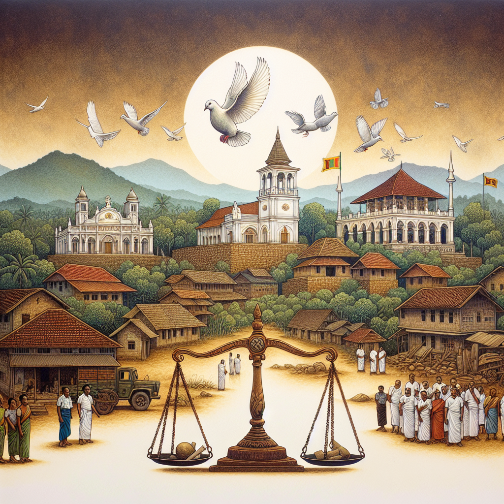

# 1998 Bharathipuram killings and accountability for wartime atrocities

## AI Generated Summary

The Bharathipuram checkpoint incident refers to the notorious killing of eight Tamil civilians in Potkeni village, Sri Lanka, in 1998, during the three-decade conflict involving the Sri Lankan armed forces, police, and the Liberation Tigers of Tamil Eelam (LTTE). Although initially rare, this case saw some judicial accountability as thirteen policemen and home guards were eventually arrested, leading to indictments for unlawful assembly and abduction with intent to murder. However, charges were withdrawn against some, and the case proceeded against seven accused individuals.

Witness testimonies largely supported the prosecution, with many recounting the abduction and subsequent murders near the Bharathipuram checkpoint, despite contradictions and evasions from some defense witnesses. Ultimately, five police officers were convicted of being part of an unlawful assembly with intent to murder but acquitted of direct murder charges due to insufficient evidence. The court noted the involvement of senior police officers and their failure to protect the civilians, indirectly suggesting an intentional disregard for their lives.

Though only one of the 37 charges resulted in conviction and justice came 26 years after the incident, this judgment offers a glimmer of hope that accountability for similar wartime atrocities may still be achievable, highlighting systemic issues in prosecuting military and police personnel accused of crimes against Tamil civilians.

## Original Text

[https://www.dailymirror.lk/opinion/1998-Bharathipuram-killings-and-accountability-for-wartime-atrocities/172-282770](https://www.dailymirror.lk/opinion/1998-Bharathipuram-killings-and-accountability-for-wartime-atrocities/172-282770)

*2024-05-17T00:51:00+05:30*

Bharathipuram checkpoint

The killing of civilians and other atrocities were widespread during the three-decade war mostly in the North and the East. The Sri Lankan armed forces, police and the Liberation Tigers of Tamil Eelam (LTTE) are alleged to be responsible for many such massacres according to eye witnesses and circumstantial evidence. It’s rare that the Sri Lankan armed forces and police have been held accountable through domestic courts for such killings. Below are some observations and reflections on such a rare case, based on reading the case and talking to families of victims. 

The incident

Bharathipuram is a small village in the Trincomalee district in the Eastern Province. The police checkpoint in the village, run under the Kantale police, had come under attack on the night of January 31, 1998 till the early hours of February 1. There were no reports of injuries or fatalities to the police due to the attack. On February 1, 1998 morning, 8 persons, all male, including at least two teenage children, from the nearby village of Potkeni were abducted and later, their bodies were found near the checkpoint. The families said the abducted were taken away by the armed men in police uniform, but they had covered their faces and were not identifiable. Several family members stated that the police had good relations with villagers, including some of those killed. Below are those killed.

Ponnambalam Kanagasaby,  Arumugam Segar,  Amirthalingam Surendran ,  Amirthalingam Gajendran ,Kunarathnam Sivarajah, Subramanium Kivakaran, Nagan Pachalanathan and Murugesu Jaganan 

One young woman was taken from her home by armed men, beaten and taken to the checkpoint where she was threatened that she would be shot dead. She had been accused of being part of the LTTE. Later, a senior police officer had ordered her release. She had seen one person being shot at the checkpoint who she had identified as Sivarajah, one of the 8 killed. She had also seen another body nearby which she had not been able to identify. She said she was able to identify one person who had abducted her and beat her in court. 

Nine years later in 2007, a brother of one of the victims was also found shot dead near a railway crossing at Pathinipuram, near the family home in Potkeni. According to the father, those responsible for the crime have not been held accountable. 

Investigations and Trial

After some investigations by the Kantale police and the Criminal Investigation Department (CID) of the police, 13 policemen and home guards (also called village guards) were arrested. The Attorney General (AG) had filed charges against all the 13 in 2005. Indictments were based on the penal code and emergency regulations dealing with unlawful assembly and abduction to wrongfully and secretly detain and murder. In 2017, the AG withdrew the charges against 6 accused (9th, 10th, 11th, 12th and 13th) and the 7th accused was murdered. Hence, the trial was conducted in relation to 7 others accused. 

The names of the 8 persons killed, the day they were killed and the fact that they were killed by firearms were not disputed by the defence. 

Thirty-six witnesses were called by the prosecution and many testified to hearing gunfire throughout the night of 31st January and the early hours of the following day around the Bharathipuram checkpoint. One witness had testified that her brother and her brother-in-law who were abducted from the house and taken towards the checkpoint close to the house were later found dead. This was not challenged by the accused. Another witness had testified that 6 persons including the relatives and neighbours who were abducted by gunmen during a function in her house were later found dead. Another witness had testified that her son who had been abducted from a nearby house where he had gone for a function was later found dead. All of these were in the early hours of 1st February. 

A policeman had testified that he had seen 2 bodies in civilian clothing on the morning of 1st February inside the checkpoint and that he had also seen the 5th accused (Somarathna) there. But the court had decided to disregard his testimony citing contradictions in his previous statements to the police and the CID. Another policeman testified that he had seen the 2nd accused (Konara) bringing two civilians to the checkpoint and later were seen the 4th accused (Ranaraja Bandara) near those two civilians. He had said another person (not any of the accused) took the two persons behind the checkpoint and that he had later seen them dead. This testimony had not been challenged by the defence. Yet another policeman had testified that the 2nd, 4th and 8th accused (Medawela) were present at the checkpoint on that morning and were identified in court. He had also identified the 5th accused in court and testified that he had seen the 5th accused bringing two civilians to the checkpoint and that the two civilians were later taken behind the checkpoint by the 2nd accused. And that when he had gone behind the checkpoint, he had also seen the 4th accused in a nearby room with the two civilians on a mattress with their hands tied behind their backs. He also testified that he had seen the 1st accused (Chandrarathna) taking the two civilians outside and shooting them. This witness had been cross-examined by the defence, but his testimony narrated above had not been challenged. This witness  further testified that the 8th accused and some others had brought some more civilians to the checkpoint and that he had subsequently seen the dead bodies of three other civilians. A witness from the Civil Defence Force (CDF), had testified that he had seen some civilians near the checkpoint and that later, he had seen their dead bodies behind the checkpoint. This testimony too was also not challenged. 

Witnesses for Defence and Dock statements from the accused 

The defence called 2 witnesses. One of them, Chief Inspector Silva’s testimony, along with the report of the Government analyst, indicated that firearms issued to the accused were not involved in the shooting and the prosecution also accepted this. The court noted that the testimony of the other defence witness, Assistant Superintendent of Police (ASP) Narampanawa didn’t in any way challenge the evidence presented by the prosecution. 

None of the 7 accused gave testimony on oath, but 6 of the accused made dock statements. There was no dock statement from the 1st accused who has been absconding from court. The 2nd accused had not denied he had brought two civilians from a nearby village to the checkpoint. The 4th accused had denied knowing about the incident, but the court had noted that he was a senior police officer (Inspector) in whose presence 8 civilians had been killed and he had some responsibility. The 5th accused had made a dock statement but not denied statements by witnesses that he had brought civilians to the checkpoint. The 8th accused had denied he was present in the vicinity of the checkpoint, but the court found that he had not challenged the testimony against him during the trial by witnesses except by saying it was due to personal animosity. 

Judgment 

The Government Analyst report indicated that the weapon that was used for the murder was a T-56 type weapon bearing number 1513631. It was confirmed during the trial that this weapon was issued to the Bharathipuram checkpoint. However, there was no indication to whom it was issued. The court noted that there was no evidence to prove that the weapon had been used by any of the accused in the case. 

On the 1st charge, being part of unlawful assembly to commit murder, the court had decided that the 1st, 2nd, 4th, 5th and 8th accused were guilty of unlawful assembly with intent to murder. Below are the names of the policemen found guilty;

Kohonakoralalage Chandrarathna Bandara,  Konara Mudiyanselage Nihal Premasiri Konara,  Rajapaksa Muditanselage Ranaraja Bandara,  Yagama Liyanage Somarathna and Rateralalage Senarath Bandara Medawela 

The 2nd cluster of charges (charges 2–9) were related to the murder and the 3rd cluster of charges (charges 10–17) had been based on “common intention” as per Article 32 of the penal code. The court had decided to acquit all the accused as there was no adequate evidence. The 4th cluster of charges (charges 18-37) was about abductions. The court noted that though the prosecution had shown beyond reasonable doubt that the 2nd, 4th and 8th accused had brought civilians to the checkpoint, there was no evidence they had abducted the civilians from their homes. The court also noted that many relatives of the dead had given testimonies about them being abducted, but none had been able to identify any of the abductors. Thus, the court acquitted all the accused of these charges. A woman had identified the 6th accused in open court as being part of a group that abducted her, but the court noted that she had failed to identify him during an identification parade immediately after the incident, and acquitted the 6th accused as the prosecution was not able to show his guilt beyond reasonable doubt. The 3rd accused was acquitted as there had been no evidence against him. 

Reflections

According to the families, a compensation of Rs. 50,000 per person has been paid.

The incident appears to be one of the many incidents of military and police targeting civilians after being targeted by the LTTE during the war in the North and the East. The approach of trying to label civilians killed as “LTTE” has also happened in this case, including an ASP acknowledging he had done this in a report to the court without any basis. The families were also threatened to sign documents saying the dead were LTTE members whom they had resisted. 

The case also followed a somewhat familiar pattern of cases in which the military and the police are accused of killing and causing enforced disappearances of Tamils, get transferred to areas outside the North and the East, which are predominantly Sinhalese. This has made it difficult for Tamil victims’ families to travel, obtain legal representation and follow the case as the court language is often in Sinhalese. In this case, the Tamil families of victims were keen to see the judgment, but it’s in Sinhalese. 

In examining the charges of murder, the court had accepted that the prosecution had proven beyond reasonable doubt that the 1st accused had shot two of the eight persons who had been killed. He was also acquitted of this charge. The court had determined the weapon used for the murder was issued to the Bharathipuram checkpoint, but there is no reference to the person in charge of the checkpoint in the judgment. However, the Court noted that the 4th accused was a senior officer (Inspector) who had not inquired into the purpose of bringing civilians to the checkpoint, not taken steps to ensure their security and kept silent till they were dead and that this indicated his intention was to have them killed.

Some of the most significant testimonies that led to the conviction of five police officers and home guards came from policemen and a home guard. 

The conviction is only to 1 of 37 charges and those convicted were relatively junior officers and 26 years is a long time for families to wait for justice. But this rare judgment of holding policemen responsible for killing of Tamil civilians provides cautious hope that justice might be possible in some other similar cases too. 

