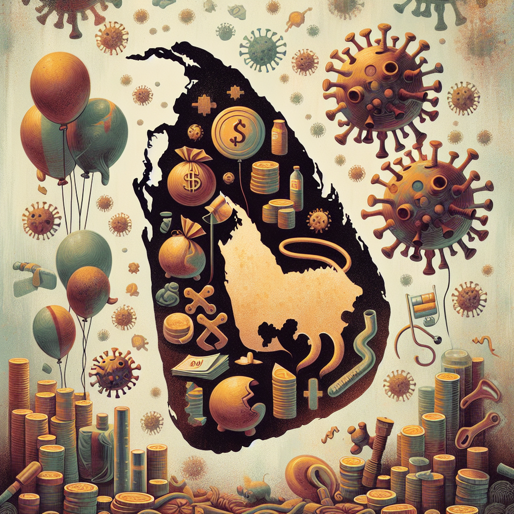

# Is Sri Lanka’s population truly declining amid economic crisis and COVID-19?

## AI Generated Summary

The article explores Sri Lanka's population dynamics, emphasizing resilience despite short-term declines due to factors such as the COVID-19 pandemic, economic uncertainties, and migration. Historical precedents suggest that population trends, influenced by fertility, mortality, and migration, show potential recovery after disruptions.

**Fertility Dynamics:**
- The COVID-19 pandemic led to delayed marriages and childbirth, causing a temporary decline in birth rates.
- Historical events like the tsunami in 2004 and the civil war's end in 2009 witnessed similar temporary declines followed by rebounds in fertility rates.
- Post-pandemic, fertility rates in Sri Lanka are expected to recover by 2023, with the Total Fertility Rate (TFR) possibly reaching replacement levels by the mid-2020s.

**Mortality Dynamics:**
- The pandemic reduced life expectancy, with visible impacts on older adults and those with pre-existing health conditions.
- Effective early measures and robust healthcare systems helped manage mortality rates.
- The mortality increase is expected to continue due to population aging, with a greater number of annual deaths due to earlier high fertility rates.

**Migration Dynamics:**
- Migration patterns were deeply affected by the pandemic, with a significant decline in foreign employment departures in 2020.
- Economic crises have fueled recent high levels of outward migration, especially among youth seeking better job opportunities abroad.
- Migration trends are expected to persist until mid-century due to ongoing economic challenges.

In conclusion, while short-term trends signal population decline, historical evidence points to potential resilience and rebound. Policymakers need to monitor demographic trends, invest in healthcare, and implement economic recovery measures to support sustainable population growth. The article underscores the need for strategic interventions to navigate the impacts of current crises effectively.

## Original Text

[https://www.ft.lk/columns/Is-Sri-Lanka-s-population-truly-declining-amid-economic-crisis-and-COVID-19/4-761889](https://www.ft.lk/columns/Is-Sri-Lanka-s-population-truly-declining-amid-economic-crisis-and-COVID-19/4-761889)

*2024-05-17 00:19:49*

While short-term trends may indicate population decline, historical precedents suggest resilience and the potential for rebound

Despite concerns about declining population in Sri Lanka due to factors like reduced fertility, increased emigration, and rising mortality rates, short-term fluctuations do not necessarily signify long-term decline. Population dynamics are intricate, influenced by various factors. Even during slower growth periods, populations tend to increase due to past trends in fertility and mortality, known as population growth momentum. This article aims to provide a scientific understanding of how Sri Lanka’s population might evolve, going beyond short-term fluctuations and addressing misconceptions about population decline. 

The COVID-19 pandemic significantly impacted Sri Lanka’s population dynamics, with 16,856 COVID-19-related deaths reported by 2023. Disruptions in healthcare systems and higher mortality rates pose challenges to future population growth and life expectancy. The pandemic also caused a decline in birth rates due to delayed marriages and family planning decisions influenced by economic and health concerns. While fertility rates may rebound after managing the pandemic, economic uncertainties and job losses could further affect population dynamics, possibly leading to internal migration and emigration, reshaping population distribution. Policymakers must closely monitor demographic trends and adapt policies to support population well-being.

Fertility dynamics

The current author’s research has noted a significant trend wherein many younger women have postponed marriage due to the COVID-19 pandemic. Furthermore, married women of childbearing age have also delayed childbirth during the economic crisis period coinciding with the pandemic. According to the Registrar General’s records, it was observed that there was a loss of 17,304 births from 2019 to 2020 whereas the birth falls during the 2020 to 2021 was 16,859. It was observed that decline was much less during the 2021 to 2022 period. This implies a fertility recovery stage with the termination of the pandemic. On average, up to 2020, which is the initial year of the pandemic, there were more than 31,000 births occurred annually, but for the first time and immediately, the annual number of births have fallen below that level and then reached about 27,000 mark in 2022. This suggests an obvious rebound in the fertility rate. It is important to note that Sri Lanka observed two recoveries of that nature after 2000, first with tsunami in December 2004 and the second with termination of 30-year long war in 2009. By looking at post-tsunami and post war fertility rebound scenarios, we can realistically claim that Sri Lanka’s fertility will start rebounding from 2023. 

Historical evidence indicates that post-transitional fertility changes are typically temporary, driven by couples adjusting their childbearing behaviour in response to disasters. This suggests that the fertility adjustments seen during the COVID-19 pandemic and economic uncertainty are likely to be short-lived. Just as fertility returned to pre-disaster levels after events like the tsunami and civil war, we anticipate a similar pattern post-pandemic, although economic uncertainty may prolong the adjustment period.

We expect the fertility decline to continue until the end of 2024, with ongoing economic recovery measures. Gradual adaptation to economic challenges may lead to normalcy by late 2024, followed by a temporary fertility upsurge as postponed marriages resume. The Total Fertility Rate (TFR) may reach replacement level, possibly by the second half of the 2020s. Previously projected to reach replacement level by 2022, COVID-19 may have accelerated this process, with fluctuations favouring lower TFR values until around mid-2023. Subsequently, an upsurge to around 2.4 TFR is anticipated due to delayed marriages and childbearing.

Mortality dynamics

The COVID-19 pandemic significantly impacted mortality rates worldwide. In Sri Lanka, early lockdowns, high testing rates, and effective social distancing measures helped keep infection rates low. The Government allocated resources, including funds from the SAARC COVID-19 Emergency Fund to quarantine and containment measures. Sri Lanka’s robust healthcare infrastructure enabled swift responses, with healthcare workers actively monitoring and tracing cases. Military, police, and intelligence agencies contributed to virus prevention, containment, and tracing efforts.

When life tables were constructed using age-specific deaths derived for 2017 to 2019, for both sexes separately, it was discovered that the pandemic has led to a reduction in life expectancy at birth by 1.53 and 1.42 years for men and women, respectively. COVID-19 has demonstrated a particularly severe impact on older adults and individuals with pre-existing health conditions. In addition to direct COVID-19 deaths, there may be indirect effects resulting in excess mortality. These could encompass disruptions in healthcare services, delayed or inadequate treatment for other diseases, mental health issues, and socioeconomic consequences stemming from the pandemic.

Moreover, the author’s research highlights a shift from an era marked by premature deaths to one characterised by extended lifespans. This transition is expected to endure into the 21st century, marked by both an increase in the age at death and life expectancies at birth. Consequently, the rise in the number of deaths can be attributed primarily to population aging. The research anticipates a significant increase in annual deaths, surpassing previous levels, until the demographic effects of earlier high fertility rates diminish. This demographic transformation raises crucial questions for individuals, families, communities, and societies: Are we adequately prepared for the implications of longer lifespans and heightened mortality rates?

Migration dynamics

Migration patterns in Sri Lanka, distinct from fertility and mortality, are influenced by national policies, destination policies, and socio-economic factors. However, global disasters like the COVID-19 pandemic can disrupt migration flows. Historically an emigration country, Sri Lanka has seen shifts in migration trends, especially since 1977, with significant movement towards the Middle East and Southeast Asia. The pandemic led to a two-thirds decline in foreign employment departures in 2020 compared to 2019, with over 54,000 Sri Lankans repatriated by October 2020. Job losses and negative employment outcomes drove high returns, particularly from the Middle East. Recent outward migration, especially among skilled and unskilled youth, has been prompted by the current economic crisis. A 2021 survey revealed that 27% of Sri Lankans expressed a desire to emigrate, with the young and educated showing the strongest inclination.

Sri Lanka’s economic challenges predate the COVID-19 pandemic, marked by slowing growth and rising poverty due to fiscal disparities and unsustainable debt. This crisis has triggered significant job losses and increased poverty, prompting large-scale migration. International travel declined sharply from 2020 to 2022 due to pandemic restrictions but began normalising by early 2023. The subsequent economic crisis accelerated youth migration for better job prospects abroad, a trend expected to persist until the mid-century.

In conclusion, the complex interplay of factors like fertility, mortality, and migration in Sri Lanka amid the COVID-19 pandemic and economic crisis underscores the need for nuanced policymaking and strategic interventions. While short-term trends may indicate population decline, historical precedents suggest resilience and the potential for rebound. As evidenced by past crises, fertility rates can recover, mortality impacts can be managed with effective healthcare strategies, and migration patterns are influenced by economic conditions.

Moving forward, policymakers must closely monitor demographic trends and implement targeted interventions to support population well-being and sustainable growth. Investments in healthcare infrastructure, economic recovery measures, and employment opportunities are crucial to mitigate the adverse effects of the crisis and ensure a prosperous future for Sri Lanka. By addressing these challenges proactively and fostering resilience at individual and societal levels, Sri Lanka can navigate through these turbulent times and emerge stronger than before.

(The writer is Emeritus Professor of Demography at the University of Colombo. He has previously served as the Vice Chancellor and Senior Professor of Demography at the University of Colombo.)

