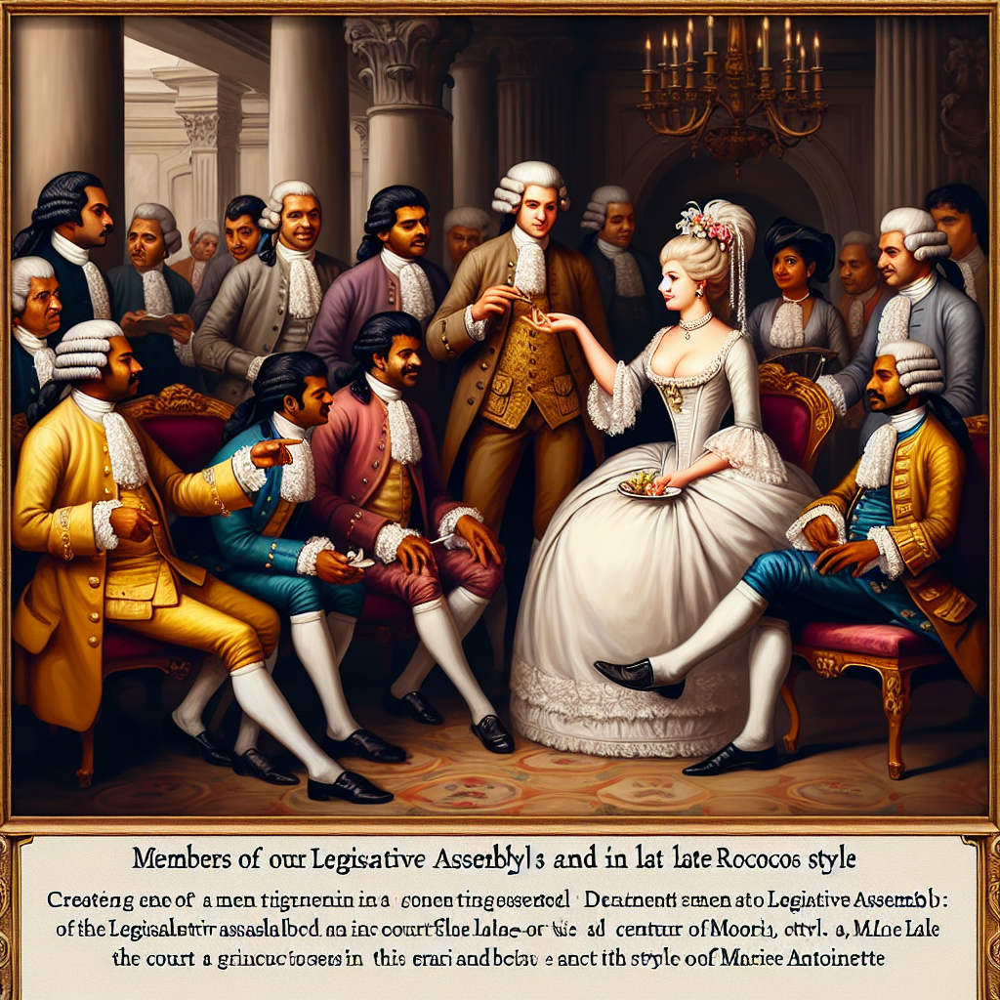

# Members of our Parliament and French Queen Marie Antoinette -EDITORIAL

## AI Generated Summary

The article criticizes the conduct and demands of Members of Parliament (MPs) in the face of Sri Lanka's ongoing economic crisis, where poverty remains high and many people struggle to afford basic necessities. MPs are accused of being profligate and unethical, demanding permits to import new cars and securing profitable liquor permits through their connections. They are also seeking to extend their substantial insurance coverage to their families, despite the country's dire financial situation. The World Bank’s data highlights that both poor and non-poor people in Sri Lanka face steep increases in the cost of living, with significant job losses in the construction sector and overall poverty rates doubling recently. This behavior of MPs is compared to that of Queen Marie Antoinette during the French Revolution, showing their disconnect from the hardships faced by common people. The article warns politicians to be mindful of the rising public anger and dissatisfaction, suggesting that ignoring the populace’s plight could lead to political repercussions in upcoming elections.

## Original Text

[https://www.dailymirror.lk/opinion/Members-of-our-Parliament-and-French-Queen-Marie-Antoinette-EDITORIAL/172-282845](https://www.dailymirror.lk/opinion/Members-of-our-Parliament-and-French-Queen-Marie-Antoinette-EDITORIAL/172-282845)

*2024-05-17T22:07:00+05:30*

Hardly a day passes without hearing the profligacy and misdeeds of one or the other members of Parliament. Just two days ago, while strong criticism was being voiced at Members of Parliament for demanding permits to import new cars for themselves, a State Minister reportedly slapped an airport worker for demanding payment for services rendered.

Media reports inform us that many MPs across the political divide have secured liquor permits in the names of their friends and relatives. These permits we all know will subsequently be sold for huge sums of money. 

According to one report, the going price per permit is around rupees fifty million. The permit is for the establishment of new liquor shops in the country.

To add insult to injury Members of Parliament are now demanding that the rupees one million insurance cover they enjoy be extended to cover their families as well. 

Oh my goodness! This is at a time when according to the World Bank the modest recovery the country’s economy has made will be insufficient to reverse welfare losses experienced during the economic crisis. Poverty is estimated to remain above 22 percent until 2026.

According to the Vice President for the South Asia Region of the World Bank Group, those already classified as poor in Sri Lanka have seen a 65% increase in their cost of living, while the increase was 57% for the non-poor, highlighting the significant loss of welfare for all Sri Lankans. 

Around 1 million informal jobs were lost in the construction sector. The cost of living has risen by over 70 % with the crisis and according to the World Bank, the poverty rate doubled to 25 % last year (2023).

Today while the cost of feeding a family of four two meals a day is well over Rs. 100,000 per month the Cabinet raised the minimum monthly wage to Rs. 17,500 in May this year!

During the French Revolution 1787-1794, at a time of great poverty and famine in France, Queen Marie Antoinette on being told the people had no bread to eat, reportedly replied ‘...let them eat cake’.

An angered people put the queen to death. 

The recent actions of our representatives in Parliament are very much akin to the behaviour of Queen Marie Antoinette. The ruling elites do not seem to realise the plight of the poor and disadvantaged sections in our country.

While the people are starving, our parliamentarians are demanding and receiving permits to import new cars. They are demanding the insurance cover of a million they receive be extended to cover their families too; and to rub salt in the wounds of a long-suffering electorate they are now seeking liquor permits to set up bars all over the country. 

Particular political leaders threaten that they are against the opening up of liquor shops. The reality as shown in the Fiscal Management Report for 2023 reveals  revenue from excise duty on liquor had increased by 32.2% to Rs. 124.6 billion in the first nine months of 2022, compared to Rs. 94.2 billion in the same period of 2021.

No government is going to ban the sale of this substance as it brings in a huge slice of government revenue. Our people know this. As we have said in these columns earlier, our people are angry and hungry.

They want simple solutions to their daily problems. They do not need sermons on the benefits of abstinence from liquor. 

With both presidential and a general election to be held in the not-so-distant future it would be good if politicians realise the masses are not asses. While they (politicians) can fool some of the people some of the time, they need to understand they cannot fool all of the people all of the time.

The writing is on the wall, it’s time to be aware the ‘day of reckoning like the ‘Ides of March’ will be soon upon them.

